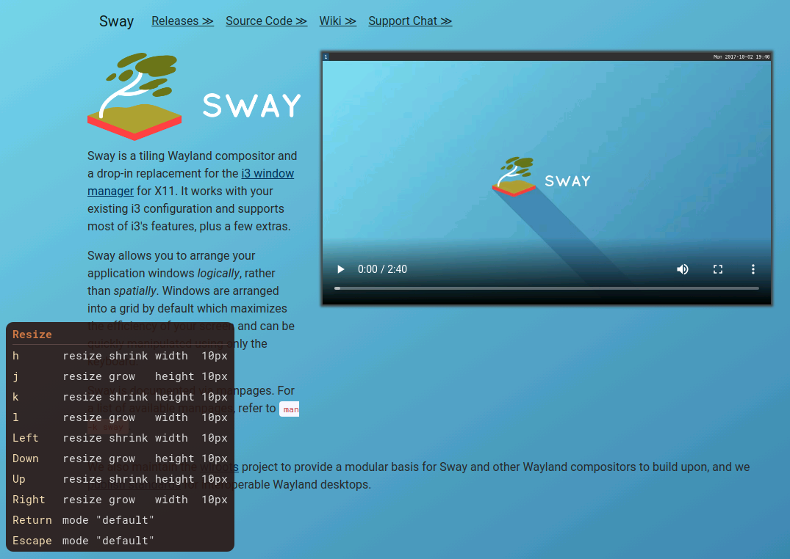

NAME
====

sway-preview-keys - Shows preview windows for [Sway](https://swaywm.org/) modes' key bindings



DESCRIPTION
===========

Gets the config from sway and parses it.

Gets the CSS style for preview windows from path specified via command option or `$XDG_CONFIG_HOME/sway-preview-keys/style.css` or `$HOME/.config/sway-preview-keys/style.css`

Finally listens to Sway mode changes and shows a preview window for mode's key bindings.

SYNOPSIS
========

    Usage:
      sway-preview-keys
        [-p|--style-path<PATH>]                  -- Set CSS style path for preview window [p=path]
        [-t|--add-mode-name]                     -- Add mode name at top of the preview window [t=title]
        [-s|--sort-key-bindings]                 -- Sort mode's key bindings [s=sort]
        [-d|--bindsym-default-mode=<NAME>]       -- Bind a symbol for previewing key bindings of default mode [d=default]
        [-r|--max-rows=<NUM>]                    -- Add columns to show key bindings when number of key bindings exceed the maximum row. Can be repeated. [r=row]
                                                    Biggest number which is lower than the number of key bindings is chosen, otherwise the minimum of the numbers is used
        [-e|--ellipsize=<NUM>]                   -- Ellipsize commands, given number is used for maximum characters to show. [e=ellipsize]
                                                    Takes effect only when number of key bindings reaches the maximum of --max-rows
        [--ellipsis-position=<start|center|end>] -- Set the position of ellipsis. Default is center.
                                                    Takes effect only when --ellipsize is used

      sway-preview-keys -v|--version -- Print version

    Example:
      sway-preview-keys -d 'Mod4+o' -t -e 26 -r 20 -r 38
      sway-preview-keys --bindsym-default-mode 'Mod4+o' --add-mode-name --ellipsize 26 --max-rows 20 --max-rows 38

Example style:

```css
#preview-window {
    font-family: monospace;
    background-color: rgba(43, 24, 21, 0.9);
    color: white;
    border-radius: 10px;
}

#preview-table {
    padding: 2px 2px;
}

#mode-name {
    font-weight: bold;
    color: #CC7744;
    margin: 0 7px;
    padding: 4px 0;
    border-bottom: 1px solid rgba(95, 75, 72, 0.9);
}

#key-binding, #command {
    padding: 4px 7px;
}

#key-binding {
    color: wheat;
}

#command {
    color: #ddd;
}
```

INSTALLATION
============

You need to have [GTK Layer Shell](https://github.com/wmww/gtk-layer-shell), [Raku](https://www.raku-lang.ir/en) and [zef](https://github.com/ugexe/zef), then run:

```console
zef install --/test "Sway::PreviewKeys:auth<zef:CIAvash>"
```

or if you have cloned the repo:

```console
zef install .
```

TESTING
=======

```console
prove -ve 'raku -I.' --ext rakutest
```

REPOSITORY
==========

[https://github.com/CIAvash/Sway-PreviewKeys](https://github.com/CIAvash/Sway-PreviewKeys)

BUG
===

[https://github.com/CIAvash/Sway-PreviewKeys/issues](https://github.com/CIAvash/Sway-PreviewKeys/issues)

AUTHOR
======

Siavash Askari Nasr - [https://www.ciavash.name/](https://www.ciavash.name/)

COPYRIGHT
=========

Copyright © 2021 Siavash Askari Nasr

LICENSE
=======

Sway::PreviewKeys is free software: you can redistribute it and/or modify it under the terms of the GNU General Public License as published by the Free Software Foundation, either version 3 of the License, or (at your option) any later version.

Sway::PreviewKeys is distributed in the hope that it will be useful, but WITHOUT ANY WARRANTY; without even the implied warranty of MERCHANTABILITY or FITNESS FOR A PARTICULAR PURPOSE. See the GNU General Public License for more details.

You should have received a copy of the GNU General Public License along with Sway::PreviewKeys. If not, see <http://www.gnu.org/licenses/>.

